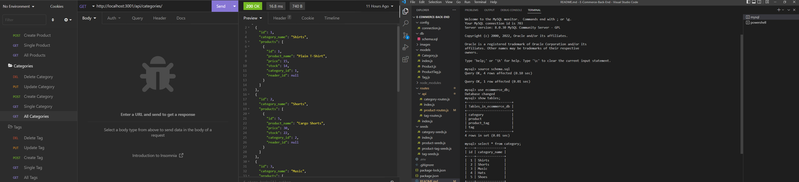

# E-Commerce-Back-End

## Description

My motivation in completing this project was to apply what I learned this week about Object Relational Mapping (ORM). I built this project because I wanted to test my skills and see if I could be effective in creating an E-Commerce Backend. The E-Commerce Backend solves the problem of.... Through this project I learned more about..... I faced a few challenges with this project, but I mostly struggled with.....

## Application Appearance

## Video Walk-through Link
